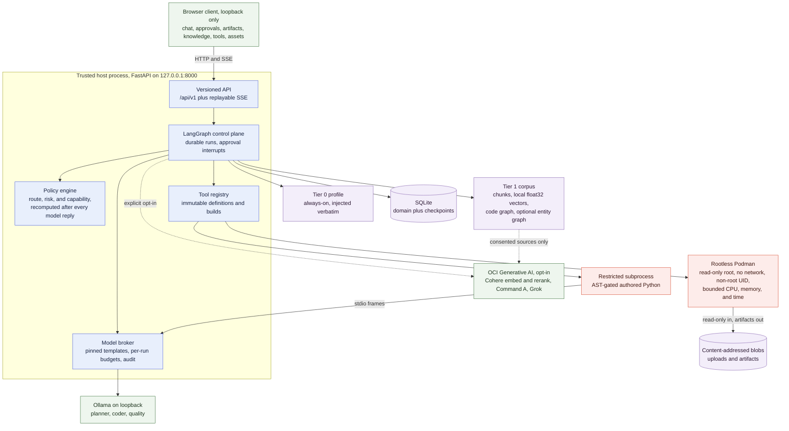
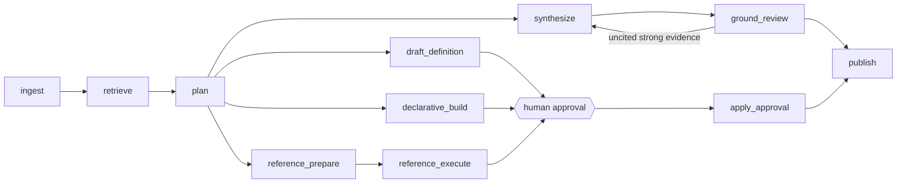

# Metis

Metis is a local-first, single-user agent platform. It runs on your own machine, keeps your data in local SQLite and a content-addressed blob store, and executes generated code inside a rootless Podman boundary that has no network and no route to your models.

Its distinguishing property is that it extends itself under review. When no existing capability fits a request, Metis can define a new tool, have a model author that tool's implementation, gate the implementation through a static-analysis allowlist, evaluate it, and store it as an immutable versioned record. Two explicit human approvals stand between a proposal and an active capability. Nothing is trained, and no model weights are ever changed.

## Reference architecture



The invariants the diagram encodes:

- The FastAPI process is the only trusted component. It decides route, risk, and capability, and it recomputes all three after every model response.
- Generated code never reaches a model directly. It reaches the broker over newline-delimited stdio frames, and the broker enforces a pinned prompt template, a per-run call and token budget, and an audit event per call.
- The Podman sandbox has no network and no route to Ollama. A model-backed capability is therefore a declarative workflow: the host performs typed model steps and passes only validated output into the deterministic sandbox step.
- Uploaded text is evidence, never authority. It cannot approve an action, widen a filesystem grant, enable networking, or enter long-term memory on its own.
- Cloud calls are off until you turn them on, and per-source consent gates every byte of corpus text that leaves the machine. Vectors and the index always stay local.

### How one request flows



`retrieve` gathers the profile and any relevant corpus passages. `plan` classifies the request into one of four routes: answer directly, reuse an active tool, build a defined tool, or draft a new definition. The answer path is a bounded generator and verifier pair: if strongly relevant retrieved passages went uncited, the verifier sends exactly one revision back. The revision count lives in graph state rather than in the model, so the loop always terminates.

## Repository layout

| Path | Contents |
| --- | --- |
| `apps/api` | FastAPI service, versioned contracts, LangGraph orchestration, SQLite stores, model broker, policy gates, tool registry |
| `apps/web` | Next.js client with streamed run events, approvals, artifacts, tool versions, memory proposals, and model health |
| `skills` | Immutable AgentSkills-compatible capability bundles |
| `infra/sandbox` | Rootless Podman image, execution policy, and host runner |
| `scripts` | Smoke tests, offline packaging, and local data export |
| `docs` | Architecture invariants and offline packaging |

## Prerequisites

- Python 3.13. The locked backend environment intentionally excludes Python 3.14.
- Node.js 24 or newer and pnpm 11.
- Ollama with `qwen3.6:35b-mlx` and `north-mini-code-1.0:mlx-nvfp4` available.
- Podman for generated-code execution. Graphviz ships inside the sandbox image.
- Poppler's `pdftotext` utility for extracting text from PDF chat attachments.

## Setup

```bash
cp .env.example .env
podman machine start
make setup
make sandbox-image
```

`make setup` bootstraps the pinned `uv` release into `.venv` and performs a frozen sync from `apps/api/uv.lock`. It fails rather than silently rewriting the lock. Frontend installation likewise uses the frozen pnpm lockfile.

Start the API and web app in separate terminals:

```bash
make api
```

```bash
make web
```

Open <http://127.0.0.1:3000>. API documentation is at <http://127.0.0.1:8000/docs>.

Configuration keys use the `WAQIL_` prefix, retained from the project's earlier name so existing environments keep working. See `.env.example` for the annotated set.

## Local model sessions

Metis never starts or switches an Ollama model just because the app opened or a
request arrived. Use the model control at the top of the app to choose one
installed model, its context window, and how long it should remain warm after
the last call. The laptop-safe defaults are 32K context and a five-minute idle
window. Calls are serialized and every local role stays pinned to that one model
for the session.

If an approved run is paused and its pinned model has unloaded, the approval
action explicitly says it will relaunch that exact model before resuming.
Metis never substitutes another model. A model already running outside Metis is
treated as externally owned and is not stopped automatically.

## Customer intelligence

The **Customers** workbench keeps accounts, original notes, interactions, facts,
people, actions, evidence, and generated outputs in local SQLite. Capture always
saves the raw note first. Analysis is a separate explicit action, and if the
model is off the note remains **Waiting for analysis** without launching
anything.

Extracted material appears in one review surface and becomes account knowledge
only after **Save update**. Customer facts are never written into global
personal memory. Selecting a customer in Chat creates a hard context boundary:
only that account's reviewed record is injected, preventing another customer's
facts or general personal memory from entering the turn.

The first output is an activity-tracker Markdown update. Configure the company's
online tracker URL in the account's **Outputs** tab, then use **Copy Markdown &
open tracker**; Metis stores no tracker credentials and does not submit on your
behalf.

Accounts can also record **wins** — explicit, user-entered outcomes such as a
signed contract or a deployed Dedicated AI Cluster. A win carries a title, a
brief, the services involved, an optional DAC shape, an optional yearly ARR
figure, and a win date. The customers page shows a win tracker with total wins,
DAC wins, total yearly ARR, a by-service breakdown, and the most recent wins,
all updated the moment a win is recorded. Wins live in the same account-scoped
SQLite store (`customer_wins`, cascade-deleted with the account) and are managed
through `POST /api/v1/customers/{id}/wins`, `PUT /api/v1/customers/wins/{id}`,
and `DELETE /api/v1/customers/wins/{id}`.

## Chat and attachments

Chat accepts UTF-8 text and source files; PDF, DOCX, PPTX, and XLSX documents; and PNG, JPEG, WebP, and GIF images. Raw uploads are limited to 10 MB by default, and extracted text is limited to 64 KB per message context. Raster images are signature-checked, stored locally, and described to the current text-only model by filename, media type, and dimensions; the model does not yet inspect their pixels. Archives, SVG, HEIC, TIFF, environment files, corrupt packages, and documents without extractable text all fail closed. Successful files from a multi-file selection stay attached even when another file in the same selection is rejected.

## Personal knowledge

Metis grounds answers in your own material through two local-first tiers.

**Tier 0, profile.** A small always-on Markdown file at `.data/profile.md`, exposed through `GET` and `PUT /api/v1/profile`. It holds the stable facts the agent must never miss: who you are, your role, your writing style, your hard preferences. It is injected verbatim every turn and bounded by `WAQIL_PROFILE_MAX_CHARS`, which replaces a long hand-written system prompt.

**Tier 1, corpus.** Register directories of your own code and notes as sources. Each source is chunked with structure awareness: Python by AST function and class, Markdown by heading, everything else by a line-aware window. Chunks are embedded with Cohere embed-v4 and stored as local vectors. At query time Metis embeds the question, recalls the top `WAQIL_CORPUS_RECALL_K` by cosine similarity, reranks with Cohere rerank, and injects the top `WAQIL_CORPUS_TOP_K` as cited context. Indexing is incremental by content hash, so keeping a large codebase fresh is cheap.

The Knowledge page also supports a read-only Notion mirror. Create a Notion internal integration with read-content access, share the intended top-level pages with it, save the token in Knowledge, then press **Sync now**. Sync is manual only. Metis materializes the accessible page trees as Markdown under `.data/corpus/notion` and feeds them through the same consent, indexing, reranking, and citation pipeline. Leave the optional root list empty to include every shared page tree, or supply page URLs or IDs to narrow the scope. The token is stored at `.data/notion.json` with mode `0600`, or may be supplied through `WAQIL_NOTION_TOKEN`, and is never returned by the API.

Chat defaults to **Sources: Auto**, which uses Notion whenever its passages are relevant. **Sources: Notion** is the strict mode: retrieval is filtered to Notion, and the answer may use only those passages. With no relevant support, Metis refuses cleanly rather than filling the gap from memory, an attachment, a project, or general model knowledge.

Cloud retrieval is opt-in and consent-gated. It stays off unless `WAQIL_ALLOW_CLOUD_EMBEDDINGS=true`, the OCI SDK is installed through the `cloud` extra included by `make setup`, and OCI is configured. No source is embedded until you grant it consent through `POST /api/v1/corpus/sources/{id}/consent`, and revoking consent purges that source's locally stored vectors. When any precondition is unmet, retrieval silently falls back to the local keyword path and nothing leaves the machine. Only the text being embedded or reranked and the snippets it returns are ever sent. Authentication reads `~/.oci/config`, and the private key never passes through Metis.

### Graphs over your corpus

- **Code graph.** While indexing, Metis parses each Python source with the stdlib `ast` into a call, definition, and import graph. No model and no cloud call are involved, and the result is exact and incremental. Query it with `GET /api/v1/corpus/graph/symbol/{name}` for definitions, callers, and callees, or `GET /api/v1/corpus/graph/stats`. Retrieval uses it too: after vector recall it pulls in call-graph neighbours of the top hits before reranking, controlled by `WAQIL_CORPUS_GRAPH_EXPAND`, so multi-hop code questions surface definitions that vectors alone miss.
- **Grounded answers.** Only genuinely relevant snippets are auto-injected, filtered by `WAQIL_CORPUS_MIN_RELEVANCE`. The explicit `/corpus/search` endpoint stays ungated so the Knowledge tester still shows the full ranked list. The verifier loop is tuned by `WAQIL_ANSWER_GROUNDING_MIN_SCORE` and `WAQIL_ANSWER_MAX_REVISIONS`.
- **Entity graph, opt-in.** For prose, Metis can use Cohere Command A to extract entities and relationships so you can trace connections across your writing through `GET /api/v1/corpus/entities/{name}`. It costs a model call per file and sends text to the cloud, so it stays off unless `WAQIL_CORPUS_ENTITY_GRAPH=true`. Like every cloud-derived artefact, it runs only over consented sources and is purged when consent is revoked.

## Asset library

Set `WAQIL_ASSET_ROOTS` to a JSON array of project-container paths, then open the **Assets** tab. Metis discovers each immediate child folder and derives a one-line description, category, tags, framework, entrypoint, and likely environment keys from bounded README and source metadata. Choosing **Scan for updates** refreshes the saved catalog without a server restart. Opening the page, searching, and filtering never scan project folders and never detect new projects automatically.

The client refreshes runtime state from that saved snapshot, so starting, running, failed, and stopped sessions stay visible without triggering discovery. A launch opens in the embedded Metis player as soon as its loopback service is ready. Running assets can be stopped from the player, their catalog card, or the resizable settings drawer, and leaving the player neither hides nor duplicates the underlying process.

Discovery never executes a project or installs its dependencies. One-click launch is enabled only after a project contains a reviewed `.metis/asset.json` argv manifest; see `apps/api/README.md` for the schema and safety rules. Runtime environment values stay in the current browser session and are sent only when you start that asset.

Asset launch manifests are trusted host-code recipes, not the generated-tool sandbox. Metis shows the exact argv command and requires a separate approval keyed to its fingerprint, and a changed recipe automatically loses approval. Once approved, the child still runs as your own macOS account with that account's filesystem and network access. Recipes that use `uv` prepare an isolated dependency environment on first launch and reuse its cache afterward.

The reviewed starter set in `scripts/asset-manifests.json` installs only when you explicitly run `scripts/install_asset_manifests.py --root … --apply`. The installer refuses to overwrite a manifest supplied by a project.

## Project workspaces

The chat header can open any project already present in the manually refreshed Asset catalog as a whole-project workspace. Opening a project for the first time uses Grok 4.3 through OCI Responses to create two local files:

- `.metis/project-context.json`, a deterministic bounded file and language map plus an initial architectural summary.
- `.metis/METIS.md`, durable project conventions, important paths, verification guidance, risks, learnings, and a work log that evolves as Metis completes work.

Two run-pinned modes are available. **Grok to Local** spends the cloud call on the initial map and then uses the configured local model for the bounded project loop. **Keep Grok** continues using Grok and OCI Responses function calling. Both modes expose the same host-owned tools: bounded file listing, exact-text search, ranged reads, exact-block replacement, new-file creation, and reviewed verification checks. Reads run immediately. Every write appears in the normal approval timeline and applies only after approval, and stale or ambiguous patches fail closed. Secret files, `.git`, `.metis`, symlinks, paths outside the selected project, arbitrary shell commands, and host networking are never exposed.

### Verification checks

An agent that can edit but cannot run anything can only ever hand you a patch to check yourself. A project closes that loop by declaring its own checks in `.metis/verify.json`:

```json
{
  "schema_version": "1",
  "checks": [
    { "name": "test", "command": ["make", "test"], "description": "Full suite." },
    { "name": "types", "command": ["npx", "tsc", "--noEmit"], "timeout_seconds": 120 }
  ]
}
```

The agent may only **name** a declared check. It cannot compose, extend, or suggest a command, and `command` is an argv array rather than a shell string, so there is no shell to inject into. `{python}` and `{uv}` resolve to the interpreter Metis is running under.

You approve the recipe once, by fingerprint, exactly as you approve an asset launch manifest. The approval card carries a plain-English explanation derived from the argv — "Runs the `test` target from the project's Makefile", "Type-checks the sources with TypeScript, without writing any output files" — so the decision never depends on reading argv you did not write. Editing `.metis/verify.json` changes the fingerprint and cancels the approval.

After that, checks run without further clicks so the agent can iterate to green, and each run posts its name, exit code, and duration to the timeline. Output is captured head-and-tail within `WAQIL_PROJECT_VERIFY_OUTPUT_CHARS`, a hung check is killed at its timeout, and `WAQIL_PROJECT_VERIFY_MAX_RUNS` bounds how many checks one turn may run so a check that never passes cannot consume the whole step budget. Verification is trusted host execution, not the generated-code sandbox: the child runs as your own account with your filesystem and network access. Set `WAQIL_PROJECT_VERIFY_ENABLED=false` to remove the capability entirely.

Project selection never discovers folders. Use **Assets, Scan for updates** when you want new projects to appear, then explicitly open one in chat.

## Tools that Metis builds

When no active capability matches a request, Metis can create one. The lifecycle is deliberately slow and reviewable:

1. **Define.** The host selects a reviewed archetype and hardens a draft into a tool definition record. The model proposes intent and shape but never selects capabilities; the host assigns the immutable capability profile and enforces a global budget ceiling.
2. **Gate 1.** You approve the definition and its capabilities. The record becomes immutable at this point.
3. **Build.** For a code-authoring tool, a model writes the `run(inputs, model)` implementation. The host validates it against the `pure-python-authored-v1` allowlist, which permits general stdlib logic and bans `os`, `sys`, `subprocess`, `socket`, `open`, `eval`, `exec`, `__import__`, attribute escapes, and dunder access. An optional cloud reviewer may propose an improvement, and that improvement is accepted only if it also passes the same gate. A reviewer can never widen capabilities.
4. **Evaluate.** The build runs against host-owned fixtures inside its execution boundary.
5. **Gate 2.** You approve the built version. Activation is immutable and versioned, and runs pin the exact version they began with.

Declarative tools run entirely as a host-interpreted pipeline and execute no authored code at all, so their capability profile grants no code execution. Code-authoring tools run in a restricted subprocess with a scrubbed environment, resource limits, an isolated interpreter, a guarded importer, and a hard-kill watchdog. Sandboxed image tools run under rootless Podman with a read-only root filesystem, no network, a non-root UID, dropped capabilities, bounded CPU, memory, processes, and time, read-only inputs, and a dedicated writable artifact directory.

An explicit build request can define, evaluate, activate, and use a tool within a single run when it stays inside this trusted boundary, with no redundant approval click. Inferred or broader capabilities still pause for review. Set `WAQIL_TOOL_TRUSTED_AUTO_ACTIVATION=false` to keep the two-review lifecycle in all cases. Kill switches exist at every level: `WAQIL_TOOL_FACTORY_ENABLED` pauses the whole factory, `WAQIL_TOOL_DEFINITION_ENABLED` pauses drafting only, and `WAQIL_TOOL_DISABLED_SLUGS` disables individual tools.

Dynamic dependency downloads and self-modification of the Metis core are not supported.

## Safety and learning model

Conversation summaries are automatic. Long-term memories and reusable skills are proposals: Metis records their provenance, evaluates them, and waits for approval before making them active. To save durable context, open **Memory**, write the stable fact or preference, and create a proposal. Pending proposals are never retrieved. Approving **Remember this** activates the memory for relevant future prompts, and rejecting it leaves no active item. Corrective chat feedback follows the same proposal path.

Metis also proposes durable facts on its own. When a run finishes, it reads what was asked and what was concluded and suggests anything that looks like a stable preference, convention, or decision. These arrive as ordinary pending proposals, deduplicated against what is already active or already waiting, so nothing enters long-term memory without your approval however confident the suggestion was. Set `WAQIL_MEMORY_HARVEST_ENABLED=false` to turn the suggestions off.

### Memory retrieval

Approved memories are found by keyword by default, which means a memory written one way can be missed by a question phrased another way. Opting memory into cloud embedding through `POST /api/v1/memory/index/consent` puts it on the same pipeline the corpus uses — embed, cosine recall, rerank — so paraphrases match. Consent for memory is deliberately separate from corpus consent: opting a code directory into cloud embedding must never silently opt in your own notes about yourself. Withdrawing consent purges every stored memory vector, and every failure along the cloud path degrades to keyword search rather than failing the turn. `GET /api/v1/memory/index` reports whether retrieval is actually semantic, which stays false when consent is granted but the cloud path is unreachable or nothing has been embedded yet.

### Run history

Each completed run is written to `.data/corpus/runs` as a Markdown document holding the request, the outcome, the files that were changed, and any artifacts, and registers itself in Knowledge as an ordinary corpus source named **Run history**. It arrives with consent off, so indexing your own past work is a visible choice; grant it and questions like "how did we fix this before" retrieve prior runs with the same chunking, reranking, and citations as any other source.

Documents record which files changed, never the contents of a diff — consent to index your notes should not become consent to index whatever a patched file happened to contain. Declined and failed edits are excluded, because a record of work that never happened is worse than no record. Set `WAQIL_RUN_HISTORY_ENABLED=false` to stop writing them.

The Settings page routes new runs either to local Ollama or to Grok 4.3 through OCI Responses. OCI mode is an explicit opt-in requiring an Enterprise AI project OCID, and X Search and OCI Code Interpreter may be enabled independently. Metis keeps its own tools, policy, conversations, and memory authoritative, and service-side OCI memory stays disabled. Grok can draft and author candidate tools, but every model call made while an approved tool executes is pinned to the local Ollama provider.

Each conversation has a stable `thread_id`, and each user message creates a distinct `run_id`. Events are committed to an outbox before they are offered over SSE, so clients resume with `after=<sequence>` and deduplicate by `(run_id, sequence)`. Approval creation, graph interruption, and the approved side effect are separate operations, and side effects use stable action IDs and persist their result so a process restart cannot repeat them.

## Verification

```bash
make test
```

```bash
make build
```

That covers 416 backend and skill-bundle tests plus 52 web tests. The backend suite uses a deterministic model provider, so it needs neither Ollama nor Podman.

Optional live checks require local model and container runtimes:

- `make verify-ollama` exercises the configured Qwen and North contracts.
- `make verify-podman` renders through the real rootless Podman boundary.
- `make verify-restart` performs a real-Podman approval, restart, and exactly-once check.
- `make verify-live` runs all three.
- `make acceptance` drives the full API-backed integration path. It creates and approves a candidate, verifies all five artifacts and replayable events, reuses the active version from a new conversation, and confirms that corrective feedback creates pending learning proposals without changing the active tool.

## Offline environment package

On a connected packaging machine, Metis can populate fresh Python and frontend caches, prove that both install offline from the frozen lockfiles, and include the digest-pinned Podman sandbox as an OCI archive:

```bash
make offline-bundle OFFLINE_BUNDLE=/path/to/metis-offline-bundle.zip
```

```bash
make offline-verify-release OFFLINE_BUNDLE=/path/to/metis-offline-bundle.zip
```

```bash
make offline-smoke-install OFFLINE_BUNDLE=/path/to/metis-offline-bundle.zip
```

The SHA-256 manifest pins the creator's OS and CPU, Python, Node.js, pnpm, uv, lockfiles, package manifests, caches, sandbox build inputs, and image digest. The bundle accompanies an exact source checkout and deliberately excludes Ollama model blobs, the Podman VM, and application data. A prerequisite-only variant exists for when the sandbox archive ships separately. See [Offline environment bundles](docs/offline-packaging.md).

## Local export

Create an integrity-checked export while Metis is running. SQLite files are copied through the online backup API, and every database, blob, and immutable tool-bundle file is recorded in a SHA-256 manifest.

```bash
make export-data EXPORT=/path/to/metis-export.zip
```

```bash
make verify-export EXPORT=/path/to/metis-export.zip
```

Metis refuses to follow symlinks or to overwrite an existing export. Keep the archive outside `.data`. It contains conversation and project data and should be handled as sensitive local material.

## Deliberate boundaries

- Inputs are uploads and explicitly granted project folders. Arbitrary persistent host-folder grants and archive traversal stay disabled.
- Approving corrective feedback queues an immutable revision request and its regression case. A later factory run must build and evaluate that revision, and no unattended background process silently changes an active version.
- Generated tools cannot install dependencies at runtime or modify the Metis core.
- Channel adapters, multi-user authentication, and autonomous internet access remain later phases.

## Further reading

- [Architecture and invariants](docs/architecture.md)
- [Offline packaging](docs/offline-packaging.md)
- [Backend service notes](apps/api/README.md)
- [Web client notes](apps/web/README.md)

## License

Released under the [MIT License](LICENSE).

---

Authored: Ali Ottoman
